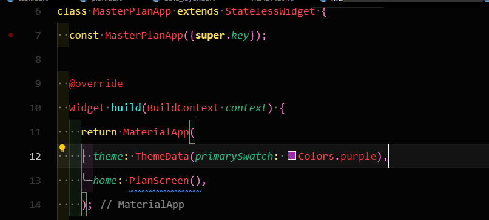
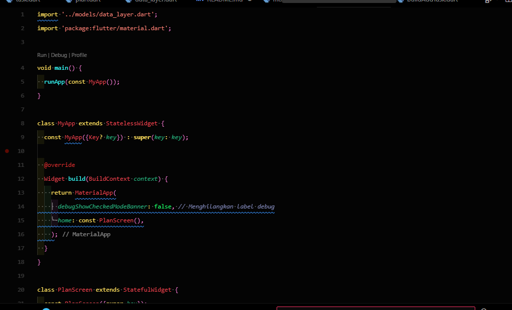
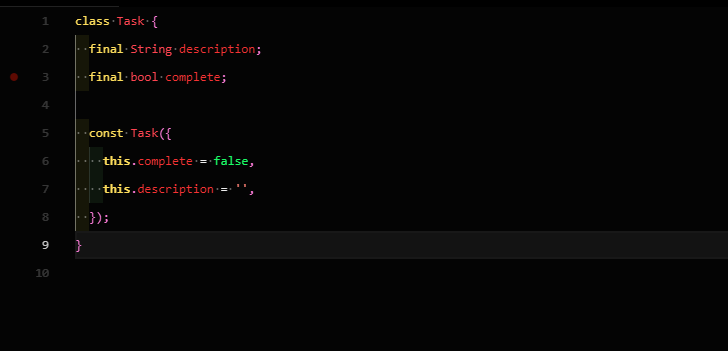
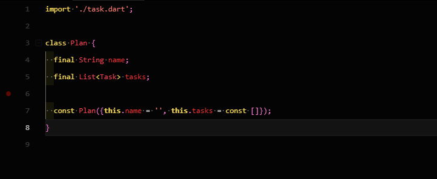
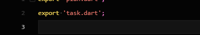
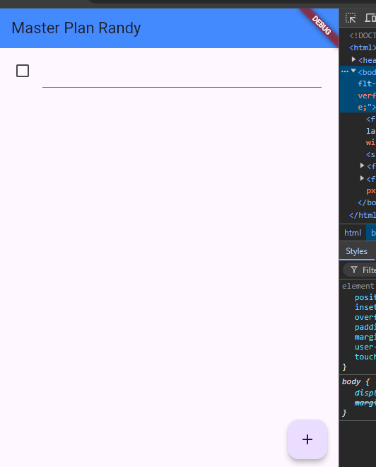

main

pada kelas plan screen

pada task

pada code plan

code data layer

pada salah satu praktikum ini memperlihatkan cara membuat aplikasi daftar tugas (todo list) dengan menggunakan Flutter. Aplikasi ini dibuat untuk membantu pengguna mengelola dan melacak tugas-tugas mereka dengan mudah.
2. 
Di dalam aplikasi ini terdapat dua komponen utama yaitu:
a. Setiap tugas individual memiliki:
Deskripsi yang menjelaskan apa yang perlu dilakukan
Tanda centang yang menunjukkan apakah tugas sudah selesai atau belum
b. Kumpulan tugas diorganisir dalam sebuah Plan yang terdiri dari:
Nama untuk mengidentifikasi kelompok tugas tersebut
Daftar lengkap tugas-tugas yang termasuk di dalamnya

3.
Untuk memudahkan pengguna, aplikasi ini dilengkapi beberapa fitur interaktif:
a. Tombol tambah (+) yang terletak di pojok layar untuk menambahkan tugas baru
b. Kotak centang di sebelah kiri setiap tugas untuk menandai penyelesaian
c. Kolom teks yang bisa diedit langsung untuk mengubah deskripsi tugas
4.
Aplikasi ini menggunakan sistem pengelolaan data yang cerdas:
a. Setiap kali ada perubahan, sistem membuat salinan baru dari keseluruhan data
b. Pendekatan ini menjamin keamanan data dan membuat perilaku aplikasi lebih mudah diprediksi
c. Tampilan aplikasi akan segera diperbarui secara otomatis ketika ada perubahan data

5.
Kenyamanan pengguna menjadi prioritas dengan adanya fitur:
a. Papan ketik yang otomatis tersembunyi ketika layar di-scroll
b. Penyesuaian khusus untuk pengalaman yang optimal di:
Perangkat iOS
Perangkat Android

6.
Metode pengembangan ini memberikan beberapa keuntungan penting:
a. Struktur aplikasi yang rapi berkat pemisahan antara data dan tampilan
b. Kemudahan dalam pengembangan fitur baru di masa mendatang
c. Proses perawatan dan perbaikan yang lebih efisien
