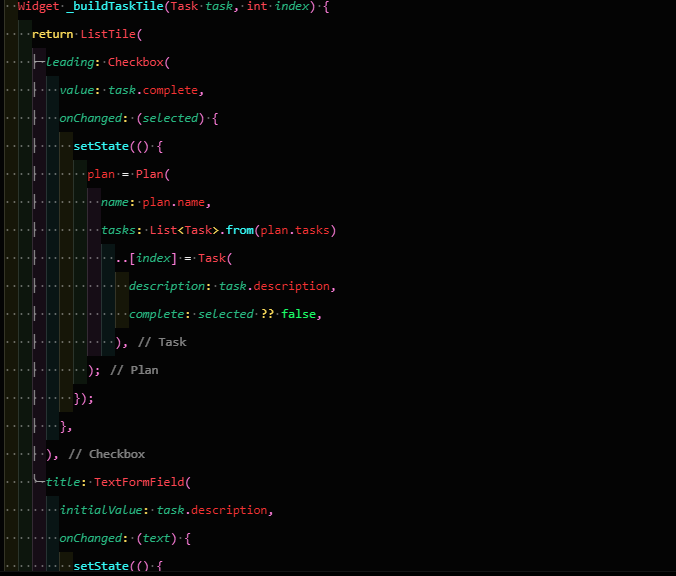

main

pada kelas plan screen

pada task

pada code plan

code data layer

pada salah satu praktikum ini memperlihatkan cara membuat aplikasi daftar tugas (todo list) dengan menggunakan Flutter. Aplikasi ini dibuat untuk membantu pengguna mengelola dan melacak tugas-tugas mereka dengan mudah.
2. 
task = mem Buat kelas Task dengan atribut description (tipe String) dan complete (tipe Boolean). Ini berfungsi sebagai model data untuk setiap tugas di aplikasi.
plan = Selanjutnya, buat file plan.dart di dalam folder models. Kelas Plan akan memiliki atribut name (nama daftar tugas) dan tasks (daftar Task yang terhubung).
data_layer Untuk memudahkan pengelolaan, buat file data_layer.dart yang menggabungkan kedua model (Task dan Plan) agar bisa diimpor lebih ringkas.
planscreen = ebagai tampilan utama untuk daftar tugas. Gunakan template StatefulWidget untuk menangani state di aplikasi. Gantilah teks Namaku dengan nama panggilan .

3.
Variabel plan di langkah 6 sangat penting karena ia berperan sebagai data inti yang menyimpan seluruh informasi tugas yang akan dikelola oleh aplikasi. plan ini menjadi tempat menyimpan daftar tugas yang bisa ditambah, diubah, atau ditandai selesai oleh pengguna.
aplikasi tidak akan punya cara untuk mengelola data tugas secara terpusat
Lalu, mengapa plan perlu dijadikan konstanta (const) di awal? Alasannya adalah untuk menjaga agar nilai awal plan tidak mudah berubah secara tidak sengaja di luar kendali aplikasi.
4.

Pada Langkah 9, kita telah membuat tampilan ListTile untuk setiap tugas.
Setiap tugas ditampilkan dengan komponen berikut:
Checkbox: Mengizinkan pengguna untuk menandai tugas sebagai selesai. Ketika checkbox dicentang, status tugas akan diperbarui di data plan, dan tampilan diperbarui secara otomatis.
Input Text: Setiap tugas memiliki kolom teks untuk deskripsi yang bisa diedit langsung. Perubahan pada kolom teks akan disimpan ke data plan, dan tampilan akan berubah sesuai deskripsi terbaru.
Dengan kata lain, tampilan ini memungkinkan pengguna untuk berinteraksi dengan daftar tugas dengan mudah, baik untuk menandai tugas selesai maupun untuk mengedit deskripsi tugas.
5.
Method initState() digunakan untuk menginisialisasi ScrollController saat widget pertama kali dibuat. dispose() digunakan untuk membersihkan ScrollController ketika widget sudah tidak diperlukan lagi, menjaga efisiensi memori.
